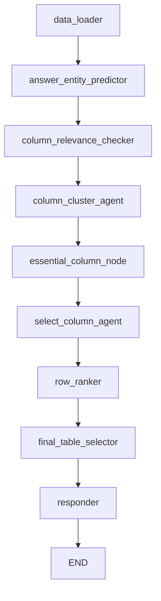
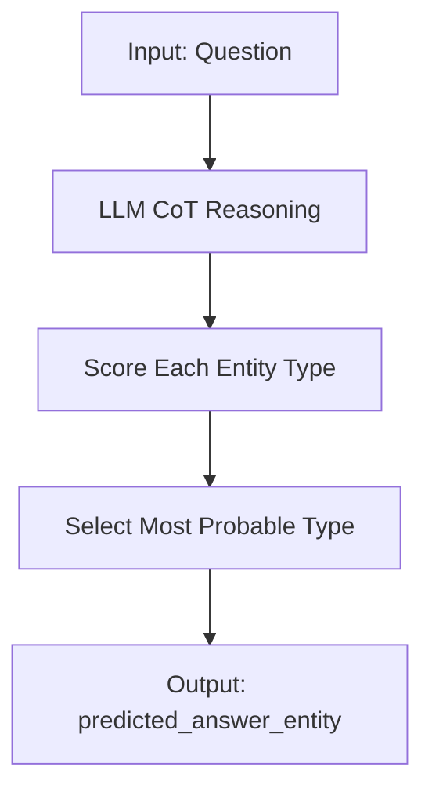
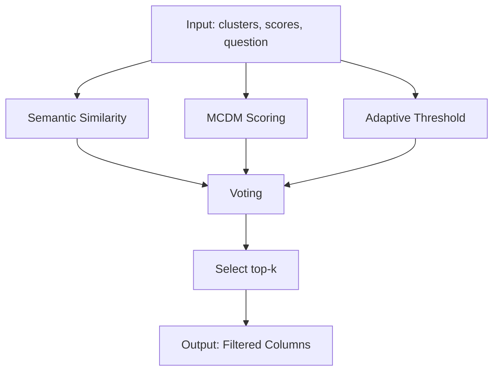
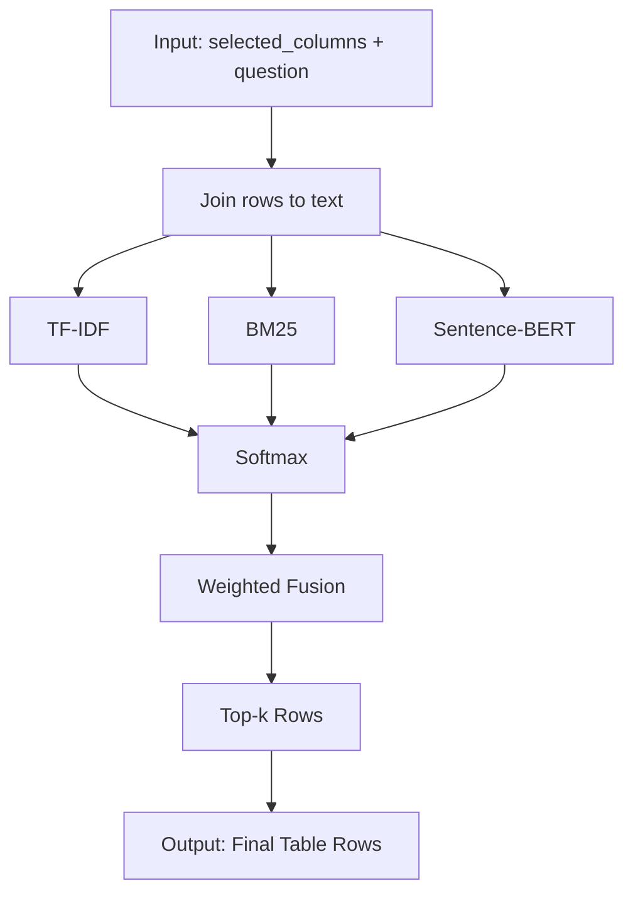

# 📘 ATF: Adaptive Table Filtering Framework for Table-based Question Answering

**[📄 Paper (arXiv)](https://arxiv.org/abs/2506.23463)**  
A modular and extensible pre-processing framework for improving TableQA performance and input efficiency.

---

## ✨ Overview

**ATF (Adaptive Table Filtering)** is a plug-and-play framework that enhances table-based question answering by **removing irrelevant columns and rows** before passing the compact table into LLMs.

It fuses **LLM-based reasoning** and **retrieval-based techniques**, making it adaptable, efficient, and accurate — especially under long-table or limited-token constraints.

---

## 🧠 Architecture

The system is modularized into the following components:

1. **Answer Entity Prediction (LLM)**
   - Predicts the entity type of the expected answer to guide the filtering process.

2. **Column Relevance Scoring**
   - Uses LLM-generated descriptions, cosine similarity, and ensemble scoring to select relevant columns.

3. **Column Clustering**
   - Clusters columns using K-means and retains the core cluster plus top-ranked others.

4. **Row Ranking**
   - Computes row relevance using TF-IDF, BM25, and Sentence-BERT embeddings.

5. **Final Table Selector**
   - Combines selected columns and rows to build a compact context for the LLM to use.

---

## ⚙️ Features

- 🧠 **Intent-aware filtering** based on question types (Who/When/etc.)
- 🔍 **Hybrid retrieval** (dense + sparse)
- 🧮 **K-means clustering** for semantic column grouping
- 📦 **Cosine similarity cache** for repeated queries
- 💬 **LangGraph agent-style orchestration** (coming soon)
- 🧪 **Failure logging & few-shot adaptation roadmap**

---


## 📊 System Flowchart



---

## 📊 Detailed Modules

<details>
<summary><strong>Entity Type Prediction</strong></summary>



</details>

<details>
<summary><strong>Column Relevance & Clustering</strong></summary>

```mermaid
graph TD
    A1[Input: Question + Raw Table]
    A1 --> A2[LLM Column Descriptions]
    A2 --> A3[LLM Scoring]
    A1 --> A4[Cosine Similarity]
    A3 --> A5[Fusion Score]
    A4 --> A5
    A5 --> A6[Clustering (K-means)]
    A6 --> A7[Output: Selected Columns]
```

</details>

<details>
<summary><strong>Cluster Selection (Ensemble)</strong></summary>



</details>

<details>
<summary><strong>Row Ranking</strong></summary>



</details>

---

## 🧪 Citation

If you use this framework or paper, please cite:

```bibtex
@misc{jang2025dropadaptivetablefiltering,
      title={What to Keep and What to Drop: Adaptive Table Filtering Framework}, 
      author={WonJune Jang},
      year={2025},
      eprint={2506.23463},
      archivePrefix={arXiv},
      primaryClass={cs.CL},
      url={https://arxiv.org/abs/2506.23463}, 
}
```

---

## 🙋‍♀️ Contact

For questions, contributions, or collaborations, feel free to reach out at:  
📧 **dnjswnswkd03@mju.ac.kr**

---
