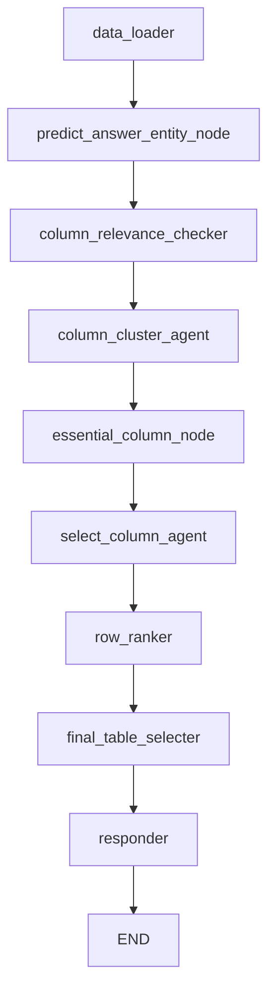
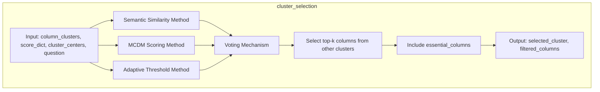
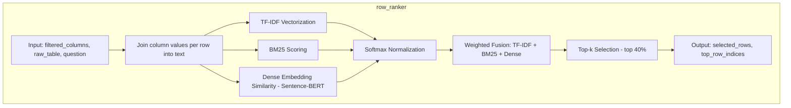

# TCRF: Table Column-Row Filtering for Table-based Question Answering

TCRF (Table Column-Row Filtering) is a modular and extensible Table QA system designed to enhance table understanding and answer generation by intelligently filtering irrelevant columns and rows. This project combines LLM-based reasoning with traditional information retrieval techniques for robust and adaptive QA over structured data.

---

## 🧠 System Architecture

The system is organized into five primary stages:

1. **PredictAnswerEntity (LLM-based Entity Type Inference)**  
   - Infers the likely entity type (e.g., Person, Organization, Date) of the expected answer based on the question.
   - Enables downstream filtering, prompt selection, or context shaping to guide accurate answer generation.

2. **ColumnRelevance (LLM + Embedding Fusion)**  
   - Analyzes the relevance of each column to the question using a combination of LLM scores and embedding-based similarity (e.g., cosine, cross-encoder).
   - Also includes sample value analysis and structure-aware scoring to distinguish categorical and numerical fields.

3. **Column Clustering**  
   - Groups semantically **similar columns** using **K-means** clustering methods.
   - Preserves columns from the primary cluster and supplements with the most relevant column from other clusters.

4. **RowRanker (Hybrid Retrieval)**  
   - Computes row relevance using a hybrid of sparse (TF-IDF, BM25) and dense retrieval.
   - Applies softmax normalization and proportionally selects rows based on table size for efficiency.

5. **FinalTableSelector**  
   - Combines selected columns and rows into a compact context table.
   - Feeds the result to an LLM or Tool Agent for final answer generation.

---

## ⚙️ Features

- 🧮 **Neural Column Attention (planned):** Future integration of transformer-style attention for structure-aware column weighting.
- 🧠 **Intent-aware Scoring:** Uses question intent (e.g., WHO/WHERE/WHEN) to prioritize relevant features.
- 📦 **Few-shot & Adaptive Learning (roadmap):** Enables better generalization to new domains and question types.
- 💬 **LangGraph Integration:** Modular execution of pipeline components via LangGraph agent-style orchestration.
- 🛠️ **Failure Logging & Feedback:** Tracks performance and logs failure types for debugging and learning.
- 🔁 **Caching System:** Fast response on similar questions using cosine similarity cache.

---

## 🚀 Roadmap

See our [Improvement Roadmap](#) for full implementation phases:
- Phase 1: Dynamic thresholding, caching, condition parser
- Phase 2: Complexity analyzer, ensemble strategies, intent mapping
- Phase 3: Neural attention, hierarchical retrieval
- Phase 4: Real-time adaptation, modular reasoning engine, cross-modal QA

---

## FlowChart

### 📊 Detailed Flow:  

```mermaid
%%{init: {'theme':'default', 'flowchart': {'nodeSpacing': 20, 'rankSpacing': 20}}}%%
graph TD
    subgraph predict_answer_entity_node
        P1[Input: Question]
        P2[LLM CoT Reasoning]
        P3[Score Each Entity Type]
        P4[Select Most Probable Type]
        P5[Output: predicted_answer_entity]
        
        P1 --> P2
        P2 --> P3
        P3 --> P4
        P4 --> P5
    end

    subgraph column_relevance_checker
        A1[Input: Question + Raw Table]
        A2[LLM-based Column Description Generation]
        A3[LLM-based Column Scoring]
        A4[Cosine Similarity with Question]
        A5[Fusion: LLM Score + Cosine Similarity]
        A6[Clustering Columns]
        A7[Output: column_relevance_scores + cluster assignments]
        
        A1 --> A2
        A2 --> A3
        A1 --> A4
        A3 --> A5
        A4 --> A5
        A5 --> A6
        A6 --> A7
    end
```

### 📊 Detailed Flow: cluster_selection (Ensemble Strategy)

### 📊 Detailed Flow: row_ranker

