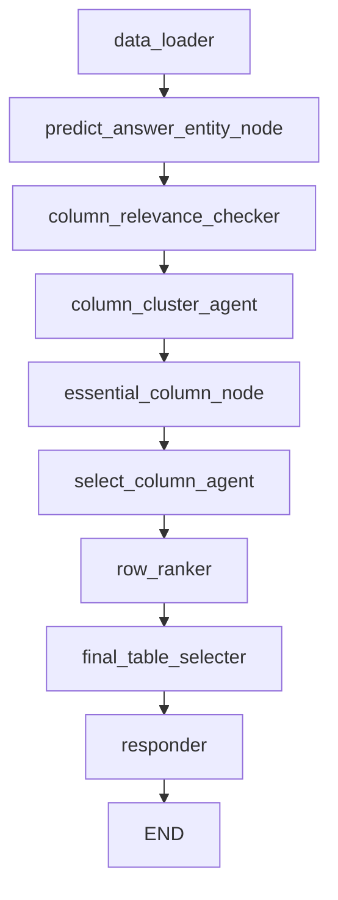
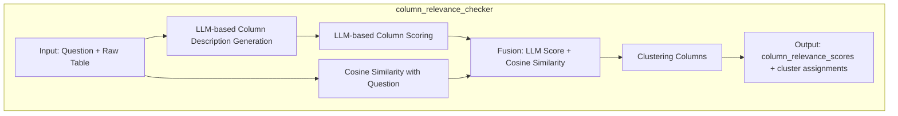

# TCRF: Table Column-Row Filtering for Table-based Question Answering

TCRF (Table Column-Row Filtering) is a modular and extensible Table QA system designed to enhance table understanding and answer generation by intelligently filtering irrelevant columns and rows. This project combines LLM-based reasoning with traditional information retrieval techniques for robust and adaptive QA over structured data.

---

## 🧠 System Architecture

The system is organized into four primary stages:

1. **ColumnRelevance (LLM + Embedding Fusion)**  
   - Analyzes the relevance of each column to the question using a combination of LLM scores and embedding-based similarity (e.g., cosine, cross-encoder).
   - Also includes sample value analysis and structure-aware scoring to distinguish categorical and numerical fields.

2. **Column Clustering**  
   - Groups semantically **similar columns** using **K-means** clustering methods.
   - Preserves columns from the primary cluster and supplements with the most relevant column from other clusters.

3. **RowRanker (Hybrid Retrieval)**  
   - Computes row relevance using a hybrid of sparse (TF-IDF, BM25) and dense retrieval.
   - Applies softmax normalization and proportionally selects rows based on table size for efficiency.

4. **FinalTableSelector**  
   - Combines selected columns and rows into a compact context table.
   - Feeds the result to an LLM or Tool Agent for final answer generation.

---

## ⚙️ Features

- 🧮 **Neural Column Attention (planned):** Future integration of transformer-style attention for structure-aware column weighting.
- 🧠 **Intent-aware Scoring:** Uses question intent (e.g., WHO/WHERE/WHEN) to prioritize relevant features.
- 📦 **Few-shot & Adaptive Learning (roadmap):** Enables better generalization to new domains and question types.
- 💬 **LangGraph Integration:** Modular execution of pipeline components via LangGraph agent-style orchestration.
- 🛠️ **Failure Logging & Feedback:** Tracks performance and logs failure types for debugging and learning.
- 🔁 **Caching System:** Fast response on similar questions using cosine similarity cache.

---

## 🚀 Roadmap

See our [Improvement Roadmap](#) for full implementation phases:
- Phase 1: Dynamic thresholding, caching, condition parser
- Phase 2: Complexity analyzer, ensemble strategies, intent mapping
- Phase 3: Neural attention, hierarchical retrieval
- Phase 4: Real-time adaptation, modular reasoning engine, cross-modal QA

---

## FlowChart

### 📊 Detailed Flow:  

### 📊 Detailed Flow: cluster_selection (Ensemble Strategy)

